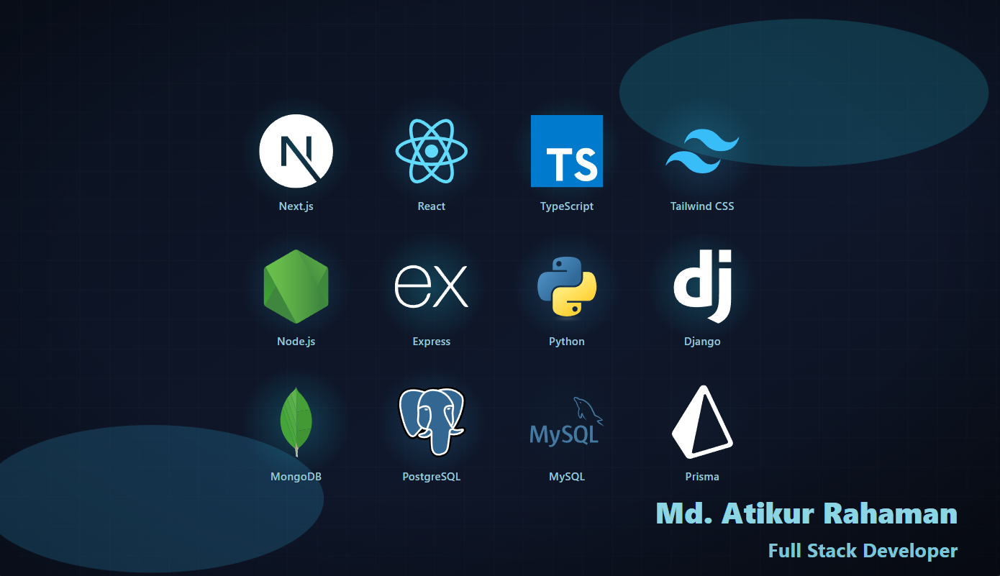

<h1 align="center">Hi 👋, I'm Atikur Rahaman</h1>
<h2 align="center">Full Stack Developer | MERN Stack Developer | Front-End Developer | Django Developer </h2>

- 🌱 I’m currently learning **Machine Learning, Docker, AWS**
- 🔭 **Key Focus Areas:**
  - Programming Languages: _TypeScript, JavaScript, Python, C, C++, Java_
  - Front-end technologies: _Next.js, React, Redux, Tailwind, Bootstrap_
  - Backend technologies: _Node.js, Express.js, Django, Django REST Framework, Mongoose, Prisma, JWT_
  - Database management: _MongoDB, MySQL, PostgreSQL, SQLite_
  - Tools: _Git, GitHub, Firebase, Postman, AWS, Figma, Vercel_
- 📫 How to reach me **[atikurrahaman0305@gmail.com](mailto:atikurrahaman0305@gmail.com)**

<h2 align="left">Connect with me:</h2>

<h2 align="left">Languages and Tools:</h2>

  
<h3 align="left">Languages</h3>

<!-- Frontend -->
<h3 align="left">Front End</h3>

<!-- Backend -->
<h3 align="left">Back End</h3>

<!-- Databases -->
<h3 align="left">Databases</h3>

<!-- General -->
<h3 align="left">Tools</h3>

# 📊 GitHub Stats:

 

 

### ✍️ Random Dev Quote

## 

